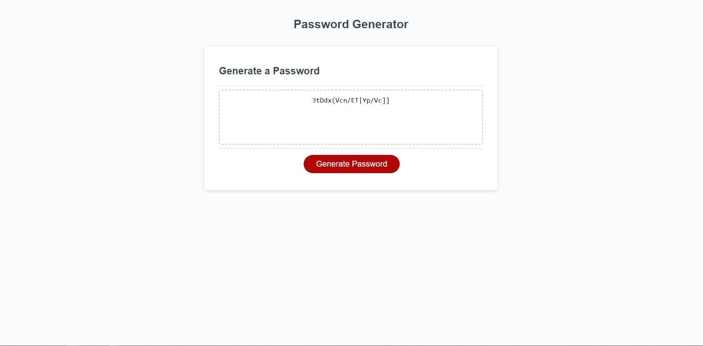

# Password Generator Assignment 


## Details of the Assignment
I have made a password generator in which it has prompts in which the user can choose how many characters they want in their password, from 8 to 128 character. They will be able to then choose lowercase letters, uppercase letters, special characters, and numbers in their password if they so choose. Afterwards the password will then be randomly generated as in the photo of the website shown below. 


## Assigment Acceptance Criteria

```
GIVEN I need a new, secure password
WHEN I click the button to generate a password
THEN I am presented with a series of prompts for password criteria
WHEN prompted for password criteria
THEN I select which criteria to include in the password
WHEN prompted for the length of the password
THEN I choose a length of at least 8 characters and no more than 128 characters
WHEN asked for character types to include in the password
THEN I confirm whether or not to include lowercase, uppercase, numeric, and/or special characters
WHEN I answer each prompt
THEN my input should be validated and at least one character type should be selected
WHEN all prompts are answered
THEN a password is generated that matches the selected criteria
WHEN the password is generated
THEN the password is either displayed in an alert or written to the page
```

## Picture of the Website



## Link for the Website

[Link to the Application](https://braymurph.github.io/Password-Generator/)

